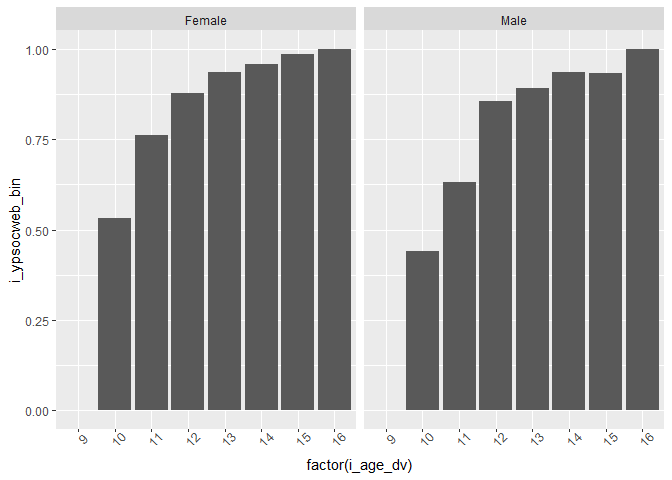

Test statistical assignment
================
Simone Long
27 January 2020

## Reading data (40 points)

``` r
suppressMessages(library(tidyverse))

youth <- read_tsv("C:/Users/simon/OneDrive/Documents/datan3_2019/data/UKDA-6614-tab/tab/ukhls_w9/i_youth.tab")
```

## Tabulate variables (10 points)

``` r
dvagetab <- table(youth$i_dvage)
knitr::kable(dvagetab,
             col.names = c("Age", "Freq"),
             caption = "*Age Frequency*")
```

| Age | Freq |
| :-- | ---: |
| 10  |  460 |
| 11  |  496 |
| 12  |  470 |
| 13  |  465 |
| 14  |  488 |
| 15  |  430 |
| 16  |   12 |

*Age Frequency*

``` r
socwebtab <- table(youth$i_ypsocweb)
knitr::kable(socwebtab,
             col.names = c("On Social Media?", "Freq"),
             caption = "*Social Media Frequency*")
```

| On Social Media? | Freq |
| :--------------- | ---: |
| \-9              |   14 |
| 1                | 2277 |
| 2                |  530 |

*Social Media Frequency*

``` r
ypsextab <- table(youth$i_ypsex)
knitr::kable(ypsextab,
             col.names = c("Sex", "Freq"),
             caption = "*Sex Frequency*")
```

| Sex | Freq |
| :-- | ---: |
| 1   | 1411 |
| 2   | 1410 |

*Sex Frequency*

## Recode variables (10 points)

``` r
youth$i_ypsocweb_bin <- NA
youth$i_ypsocweb_bin[youth$i_ypsocweb == 1] <- 1
youth$i_ypsocweb_bin[youth$i_ypsocweb == 2] <- 0
youth$i_ypsocweb_bin[youth$i_ypsocweb == -9] <- NA

youth$i_sex_bin <- ifelse(youth$i_ypsex == 1, "Male", "Female")
```

## Calculate means (10 points)

``` r
prob.age_socweb <- tapply(youth$i_ypsocweb_bin, youth$i_age_dv, mean, na.rm = TRUE)
knitr::kable(prob.age_socweb,
             col.names = c("Probability of Having Social Media"),
             caption = "*Probability of Being on Social Media Relative to Age*")
```

|    | Probability of Having Social Media |
| -- | ---------------------------------: |
| 9  |                          0.0000000 |
| 10 |                          0.4868996 |
| 11 |                          0.6989899 |
| 12 |                          0.8655098 |
| 13 |                          0.9152174 |
| 14 |                          0.9468303 |
| 15 |                          0.9585253 |
| 16 |                          1.0000000 |

*Probability of Being on Social Media Relative to Age*

``` r
prob.sex_socweb <- tapply(youth$i_ypsocweb_bin, youth$i_sex_bin, mean, na.rm = TRUE)
knitr::kable(prob.sex_socweb,
             col.names = c("Probability of Having Social Media"),
             caption = "*Probability of Being on Social Media Relative to Sex*")
```

|        | Probability of Having Social Media |
| ------ | ---------------------------------: |
| Female |                          0.8404558 |
| Male   |                          0.7818959 |

*Probability of Being on Social Media Relative to Sex*

## Write short interpretation (10 points)

There appears to be a generally positive trend in the probability of
being on social media relative to age; the older a young person is, the
more likely they are to have an online presence. As far as gender/sex is
concerned, women seem to have a higher probability of having social
media (specificially, a 6% greater likelihood). It stands to reason,
therefore, that 16 year-old girls are most likely to be active on social
media.

## Visualise results (20 points)

``` r
library(ggplot2)

ggplot(youth, aes(x = factor(i_age_dv))) +
  stat_summary_bin(aes(y = i_ypsocweb_bin), fun.y = "mean", geom = "bar", binwidth = 0.5) +
  theme(axis.text.x = element_text(size = 9, angle = 45)) + facet_grid(. ~ i_sex_bin)
```

<!-- -->
